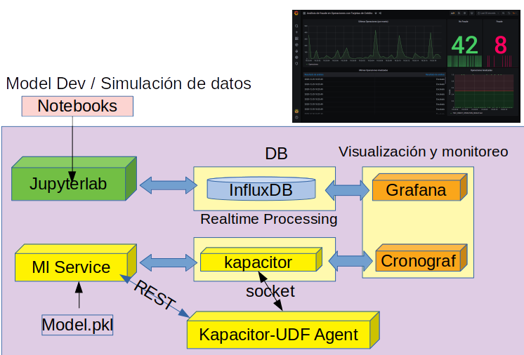
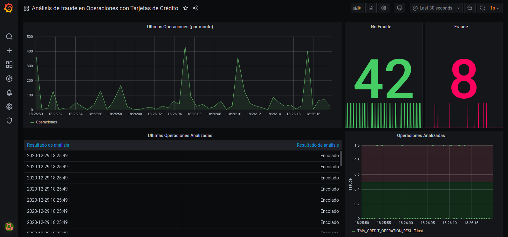

# Ejemplo de despliegue con codcker

Ejemplo de despliegue de ML con docker.



- **Arquitectura de microservicios**: 
  - Cadena de procesamiento de detección de anomalías en tiempo real utilizando:
    - Generador de datos. Por no disponer de datos reales, en este caso es un "mock" que publica muestras del test set elegidas aleatoriamente (actualizando la fecha de cada nueva muestra generada a la hora actual).
    - El servicio Kapacitor como sistema de monitoreo y alerta en tiempo real configurado para comunicarse con UDF (User Defined Functions) por medio de sockets.
    - Un servicio que utilizando el agente de UDF de Kapacitor invoca a un servicio REST de clasificación con los datos recibidos de Kapacitor.
    - Un servicio REST para utilizar un clasificador de SKLearn (presente en trabajo anterior)
  - Cronograf como administrador de tareas de Kapacitor.
  - Jupyter para análisis y prototipado rápido.

## Contenido

[TOC]

## Descripción general y alcance

Ejemplo de solución sencilla de un ambiente autocontenido para prototipado de modelos de Machine Learning en lenguaje Python basada en microservicios con docker-compose.  El foco está en poder ejercitar el proceso completo desde el desarrollo de modelos hasta su puesta en producción con fines didácticos, de prueba de concepto o académicos. Por lo tanto, hay muchos aspectos que están simplificados y no se pone atención a gestión de usuarios y permisos, performance, redundancia, disponibilidad, escalabilidad, etc. y no es apto para producción.

#### Organización de directorios:

~~~
./	
	compose					Configuración de servicios docker-compose.
		api                 API para servicio de modelos (basada en Flask).
	data 					Datos originales en CSV (fuente: Kaggle).
	notebooks				Notebooks para desarrollo de modelos.
		tmp         		Archivos temporales, diagramas generados, etc.	
	docker-compose.yml      Archivo de configuración de docker-compose.	
	models 					Modelos entrenados para uso en producción.
	README.md 				Este archivo.
~~~


### Microservicios

- Jupyter(/lab) como ambiente de desarrollo y evaluación de modelos.
- Grafana como interfaces para visualización en tiempo real.
- InfluxDB como base de datos de series temporales.
- Kapacitor como sistema de procesamiento en tiempo real.
- Cronograf como administrador de Kapacitor (también se puede utilizar para InfluxDB).

## Instrucciones

### Ejecución

Cear el directorio para el socket de comunicación utilizado por Kapacitor y el servicio de UDF:

```mkdir /tmp/comm```

Para iniciar los servicios cambiar al directorio compose y ejecutar:
```./up.sh ```

Para apagar los servicios, en el mismo directorio ejecutar:
```./down.sh```

#### Configuración por defecto

Los servicios COTS están configurados por defecto siguiendo las guías provistas de cada fabricante. 

| Servicio   | Parámetros                                                   | Observaciones                                                |
| ---------- | ------------------------------------------------------------ | ------------------------------------------------------------ |
| Jupyterlab | URL: http://localhost:10000<br/>                             | Basada en jupyter/scipy-notebook. Ver: https://jupyter-docker-stacks.readthedocs.io/en/latest/using/selecting.html#jupyter-scipy-notebook |
| Grafana    | URL: http://localhost:3000/<br/>User: admin<br/>Password: admin | Ver: https://grafana.com/docs/grafana/latest/installation/docker/ |
| Cronograf  | URL: http:localhost:8888/<br />User: vacío<br />Password: vacío | Ver: https://hub.docker.com/_/kapacitor                      |

Si se accede desde otro host, recordar configurar el firewall. Por ejemplo, en Ubuntu:

```bash
# Jupyter
sudo firewall-cmd --add-port=10000/tcp --permanent
# Grafana
sudo firewall-cmd --add-port=3000/tcp --permanent
```

#### Setup inicial / guía de uso

La primera vez que se ejecuta el compose, se descargarán las imágenes e instanciarán los containers. Las bases de datos estarán vacías.  Se deben seguir estos pasos para cargar las bases de datos y poner un modelo de ejemplo en producción.

1. Conectarse a Jupyter.
2. Abrir y ejecutar los siguientes notebooks en orden, siguiendo las instrucciones de cada uno:
   1. Descripción del Objetivo. Análisis Exploratorio Inicial, Ingeniería de Features.
   2. Preparación de dataset. Undersampling y Oversampling. SMOTE. ADASYN.
   3. Desarrollo y entrenamiento de modelos I. Optimización de HPs con Hyperopt y Optuna.
   4. Desarrollo y entrenamiento de modelos II. Ensambles
   5. Ejemplo de uso de API REST
   6. Despliegue de Solución para detección de Anomalías en Tiempo Real con microsevicios: InfluxDB, Kapacitor y Grafana.En caso de que se cuente con la capacidad de iniciar el entorno, también se pueden ver las exportaciones de la ejecución en PDF.

3. Una vez cargados los datos, es posible inspeccionarlos en Grafana y Kibana, además de hacer predicciones consumiendo la API REST.



